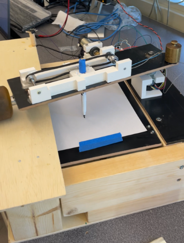
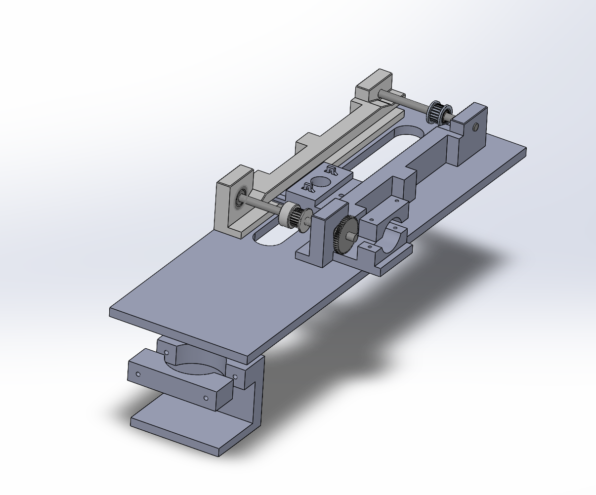
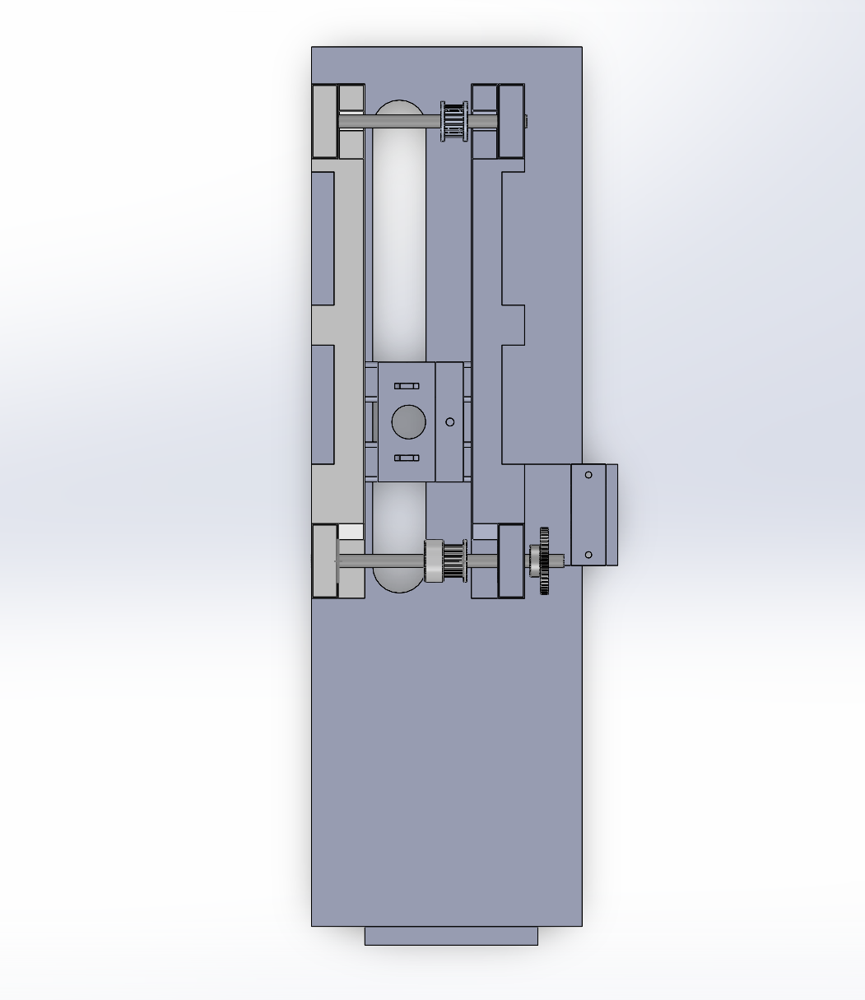
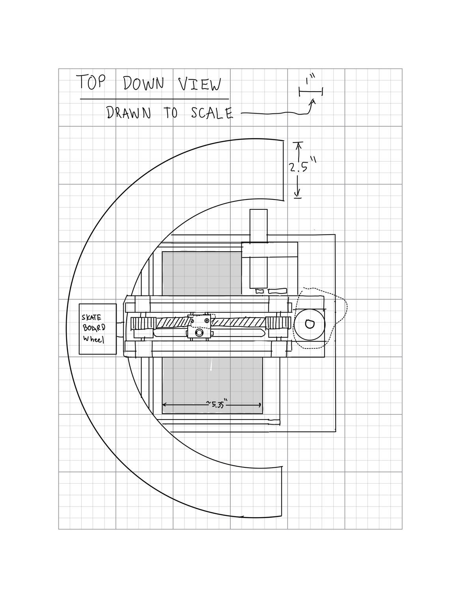
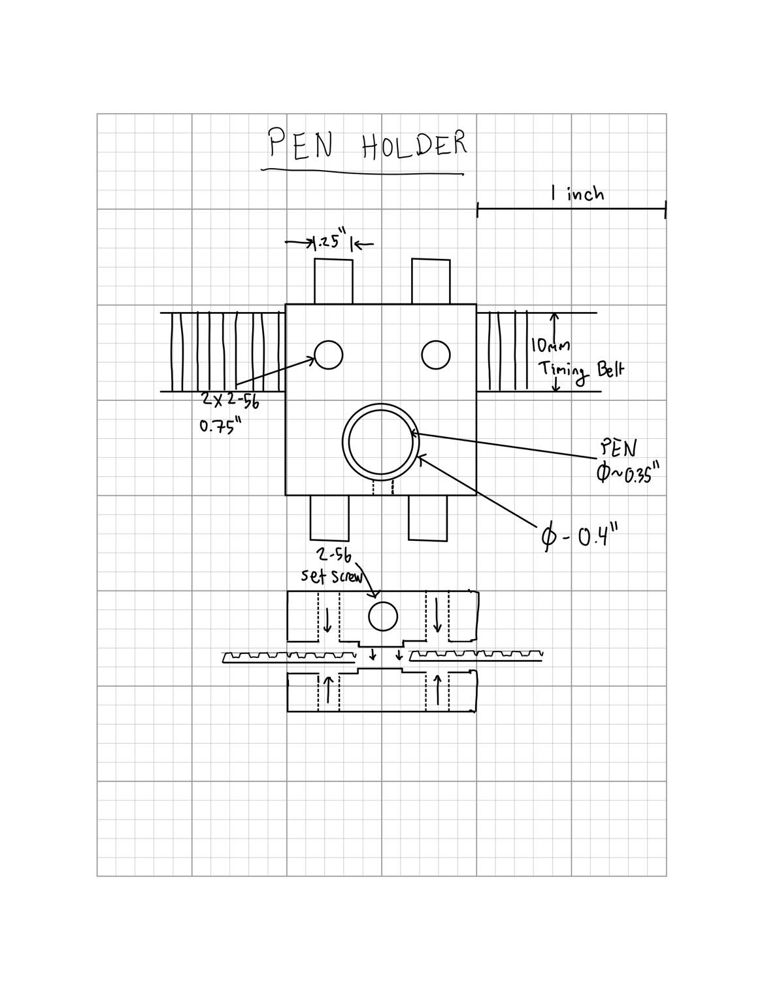
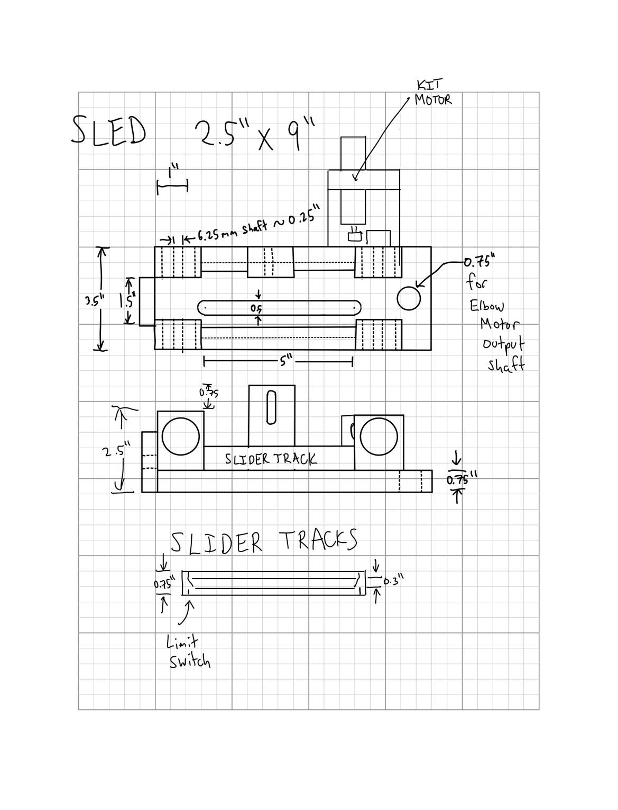
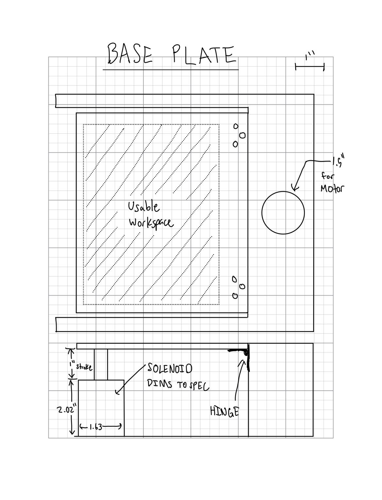
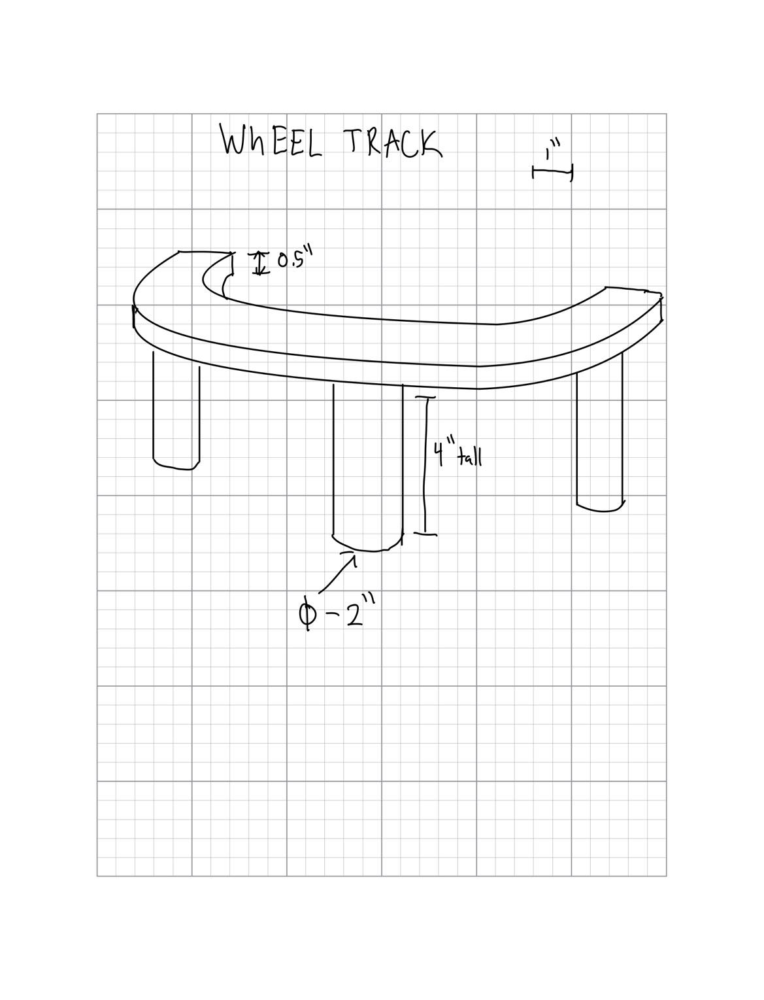

# Pen-Plotter-Cad-405-TP
 This Repository was created to show the ME 405 pen-plotter CAD repository. It contains the STL files for print as well. This repository contains manufacturing pictures as well as documents necessary to build the project.

## **Description of Project**
Our Hardware Design is broken up into three parts: the drop down table base, the track, and the sled. The drop down table base allows us to have a half degree of freedom by being in up(pen down) or in the down position (pen up). We used a 12V continuous pull solenoid, actuated with an N-channel Mosfet with a 5V Gate to Source start voltage. This in conjuction with a flyback diode, and two 4 inch springs, allowed for our drawing surface to be dropped and not be in contact with the pen. The sled was the mover of the pen. Two 3D printed side rails created a track for our pen holder. The pen holder moved along this track being guided by 6mm GT2 timing belt that was directly mounted to the holder. The belt was driven by a 48 tooth plastic gear that was geared to the provided ME 405 bin Pittperson Gearmotors. The side rails were epoxied to a 4"x13"x0.375" piece of particle board with a slot cut through the middle of it. The conjunction of the drop down table base and the sled were through the "elbow motor". The "elbow motor" was a 131:1 12V DC motor that was clamped down to a 3D printed motor mount. This motor mount was epoxied to the top of the drop down table ledge, and the nucleo is mounted next to it. The elbow motor shaft ran through the particle board sled, and interfaced with a shaft collar epoxied to the surface. In order to allow free motion of the sled across the drawing plane, a caster wheel was epoxied to the end of the sled, opposite of the elbow motor and shaft collar. A sawed off skateboard truck provided an appropriate solution. The track for the skateboard wheel was created such that the sled would be level when moving left and right. To protect the system, two limit switches were added: one on the pen holder slider, and one on the skateboard wheel track. These two limit switches were used as zeroing points in our code.

The Bill of Materials is at the bottom of the README

## **Functional Prototype**
Included Below is a link to our plotter drawing a smiley face: 
https://youtu.be/C0HX3mLi9cc

## **CAD Model**

## **Drawings**

## **Bill of Materials**
| Qty. | Part                  | Source                |    Cost   |
|:----:|:----------------------|:----------------------|:---------:|
|  1   | Pittperson Gearmotors | ME405 Tub             |     -     |
|  1   | Nucleo with Shoe      | ME405 Tub             |     -     |
|  1   | Resistors, 100, 5.1K  | ME405Resistor Notebook|     -     |
|  1   | 131:1 12V DC Motor    | DFrobot.com           |   $29.00  |
|  1   | Various Expo Markers  | Lucas Whiteboard      |     -     |
|  1   | GT2 Timing Belt,Gear, |                       |           |
|      | Timing Pulley         | Amazon.com            |   $17.39  |
|  1   | 12V Cont.Pull Solenoid| Digikey.com           |   $23.08  |
|  6   | Limit Switches        | Digikey.com           |   $8.94   |
|  3   | MosfetN-ch,IRFP250NPBF| Digikey.com           |   $7.86   |
|  6   | Diode, 1N4007G-T      | Digikey.com           |   $2.48   |
|  1   | Skateboard Wheels     | Lucas Skateboard      |     -     |
|  1   | 5mm Steel Shaft, 12in | McMaster Carr         |   $2.50   |
|  4   | 5mm Plastic Bearings  | McMaster Carr         |   $14.96  |
|  4   | 2ft 2x4               | Home Depot            |     -     |
|  2   | 5 min Epoxy           | Ace Hardware          |     -     |
|  6   | 5mm shaft collars     | McMaster Carr         |   $13.54  |
|  2   | 48T gear,2662N31      | McMaster Carr         |   $7.32   |
|  2   | 4" 0.5"D springs      | Ace Hardware          |   $8.45   |

