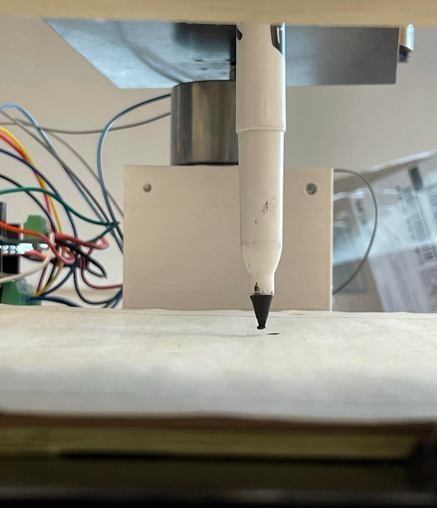
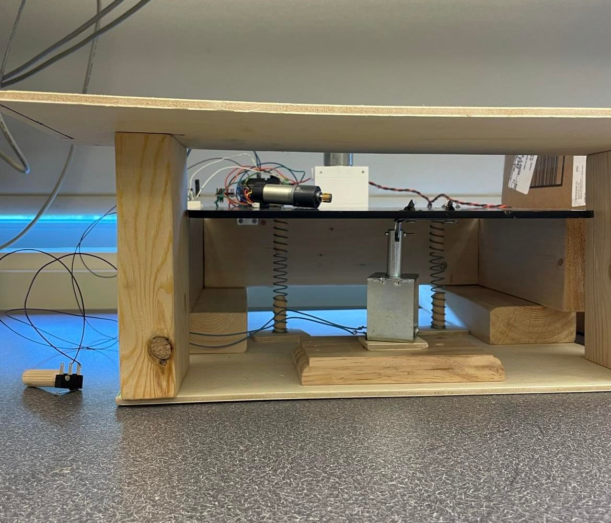
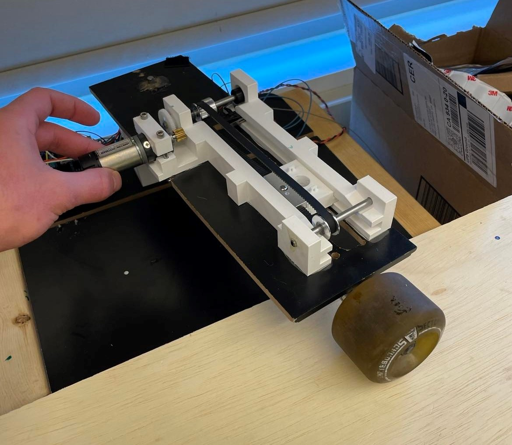

# Pen-Plotter-Cad-405-TP
 This Repository was created to show the ME 405 pen-plotter CAD repository. It contains the STL files for print as well.

## **Description of Proposed Project**
Our  system is a 2.5 axis system that will act as a pen plotter. Our system is similar to the example idea where the arm rotates radially, however it is driven by the hub instead of driven by the wheel. The wheel freely rotates on a platform that provides leveling and stability for the sled. We used a 131:1 DC motor as the "elbow motor" and 

Instead of dropping the pen to write, we will be raising the edge of the platform using a solenoid placed at the far edge of the paper holder. The paper holder will be attached to a hinge that allows it to rotate out of reach of the pen. 

## **Functional Prototype**

## **CAD Model**

## **Drawings**

## **Bill of Materials**
| Qty. | Part                  | Source                | Est. Cost |
|:----:|:----------------------|:----------------------|:---------:|
|  1   | Pittperson Gearmotors | ME405 Tub             |     -     |
|  1   | Nucleo with Shoe      | ME405 Tub             |     -     |
|  1   | Resistors, 100, 5.1K  | ME405Resistor Notebook|     -     |
|  1   | 131:1 12V DC Motor    | DFrobot.com           |   $29.00  |
|  1   | Various Expo Markers  | Lucas Whiteboard      |     -     |
|  1   | GT2 Timing Belt,Gear, |                       |           |
|      | Timing Pulley         | Amazon.com            |   $17.39  |
|  1   | 12V Cont.Pull Solenoid| Digikey.com           |   $23.08  |
|  6   | Limit Switches        | Digikey.com           |   $8.94   |
|  3   | MosfetN-ch,IRFP250NPBF| Digikey.com           |   $7.86   |
|  6   | Diode, 1N4007G-T      | Digikey.com           |   $2.48   |
|  1   | Skateboard Wheels     | Lucas Skateboard      |     -     |
|  1   | 5mm Steel Shaft, 12in | McMaster Carr         |   $2.50   |
|  4   | 5mm Plastic Bearings  | McMaster Carr         |   $14.96  |
|  4   | 2ft 2x4               | Home Depot            |     -     |
|  2   | 5 min Epoxy           | Ace Hardware          |     -     |
|  6   | 5mm shaft collars     | McMaster Carr         |   $13.54  |
|  2   | 48T gear,2662N31      | McMaster Carr         |   $7.32   |

